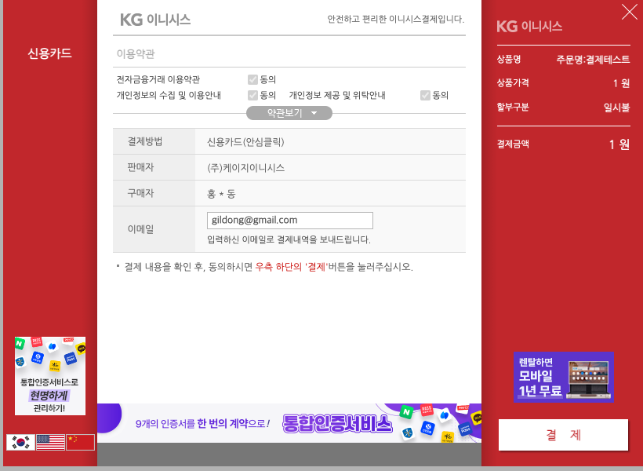

# 포트원 SDK 연동 예제

포트원((구)아임포트)에서 제공하는 SDK 사용 방법

> 포트원 SDK는 V1 사용 중입니다. V2는 결제 시 문제가 있어 현재 문의 중

## 결제하기

`/public/index.html` 파일에 다음 스크립트 태그를 추가한다.

```html
<script src="https://cdn.iamport.kr/v1/iamport.js"></script>
```

그리고 `window` 객체에서 `IMP` 객체를 찾는다. 결제 메서드는 `request_pay`

##### 파라미터 객체

| 프로퍼티     | 설명                           |
| ------------ | ------------------------------ |
| pg           | 선택할 결제사(문자열)          |
| pay_method   | 결제 수단                      |
| merchant_uid | 결제 고유번호로 직접 생성한다. |
| name         | 주문명                         |

##### 결제자 정보

| 프로퍼티       | 설명     |
| -------------- | -------- |
| buyer_email    | 이메일   |
| buyer_name     | 이름     |
| buyer_tel      | 전화번호 |
| buyer_addr     | 주소     |
| buyer_postcode | 주소번호 |

결제 후 다음과 같이 결제자 정보가 자동으로 입력되어 진다.

예시로 구매자 이름은 "홍길동", 이메일은 "gildong@gmail.com"으로 되어 있다.



### 응답 JSON 예제

```json
{
  "success": true,
  "imp_uid": "imp_557602550454",
  "pay_method": "card",
  "merchant_uid": "merchant_1698309602250",
  "name": "주문명:결제테스트",
  "paid_amount": 1,
  "currency": "KRW",
  "pg_provider": "html5_inicis",
  "pg_type": "payment",
  "pg_tid": "StdpayCARDINIpayTest20231026174122328482",
  "apply_num": "30008345",
  "buyer_name": "홍길동",
  "buyer_email": "gildong@gmail.com",
  "buyer_tel": "010-4242-4242",
  "buyer_addr": "서울특별시 강남구 신사동",
  "buyer_postcode": "01181",
  "custom_data": null,
  "status": "paid",
  "paid_at": 1698309682,
  "receipt_url": "https://iniweb.inicis.com/DefaultWebApp/mall/cr/cm/mCmReceipt_head.jsp?noTid=StdpayCARDINIpayTest20231026174122328482&noMethod=1",
  "card_name": "국민KB카드",
  "bank_name": null,
  "card_quota": 0,
  "card_number": "523612*********0"
}
```
